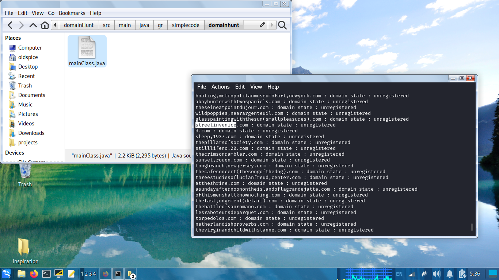

# domainHunt 



Explore available domain names inspired by given dictionary.

## Prepare

You will need to install `make` and `JDK`, preferably `OpenJDK 17`.

On Debian-based systems:
```
sudo apt install make openjdk-17-jre-headless
```

If you already have a conflicting version of `OpenJDK`, you may find handy using `SDKMAN!`.

## Build and Run

To build : 
```
make build
```

To simply :
```
make run
```

To build and run :
```
make build-run
```

## Example of running

```
make build-run 
```

```
thegirlwithapearlearring.com : unregistered
portraitofayoungvenetianwoman.com : unregistered
portraitofdaniel-henrykahnweiler.com : unregistered
thebattlebetweenlentandcarnival.com : unregistered
skullwithburningcigarette.com : unregistered
self-portraitwithmonkeys.com : unregistered
selfportraitwithbandagedearandpipe.com : unregistered
greatsceneofagony.com : unregistered
seascapeatsaintes-maries.com : unregistered
viewofmurnauwithtrainandcastel.com : unregistered
thegrandcanalandthechurchofthesalute.com : unregistered
sabartes.com : unregistered
sunsetatsea.com : unregistered
```
